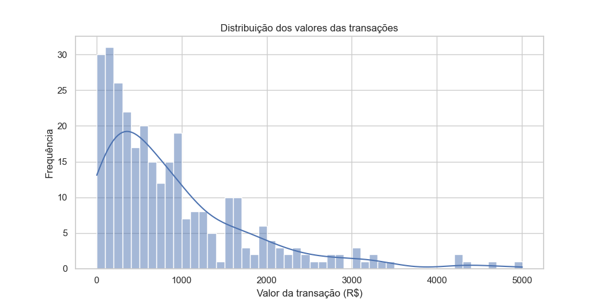
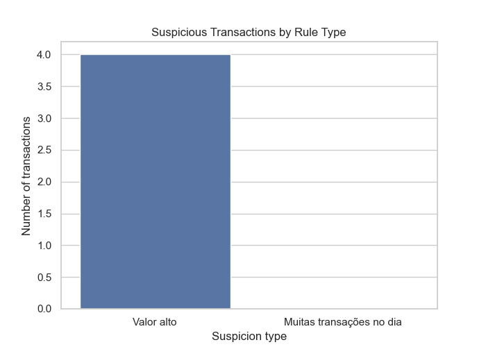
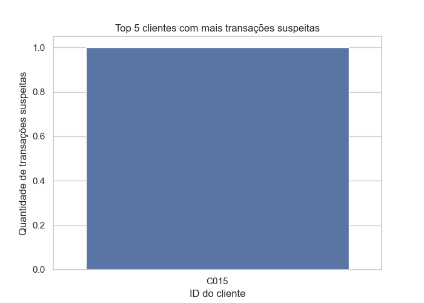

# 🔍 Anti-Fraud Study with Python

This is a simple data analysis project developed to practice Python and basic concepts of bank fraud detection. The project simulates fictional transactions and applies rules to identify suspicious behavior.

---

## 🎯 Objective

Create an introductory anti-fraud study using Python, analyzing transactions based on two simple rules:

1 - Transactions over R$ 5,000 are considered suspicious.

2 - Customers with more than 3 transactions on the same day are flagged as suspicious due to frequency.

---

## 🛠️ Technologies Used
- Python
- Jupyter Notebook (VSCode)
- Pandas
- NumPy
- Matplotlib
- Seaborn

---

## 📊  Results and Visualizations

A total of 300 fictional transactions from 20 different customers were generated and analyzed. Based on the defined rules, suspicious transactions were identified.

### 📈 Transaction Amount Distribution

### ⚠️ Suspicious Transactions by Type

### 👥 Top 5 Customers with the Most Suspicious Transactions

-

